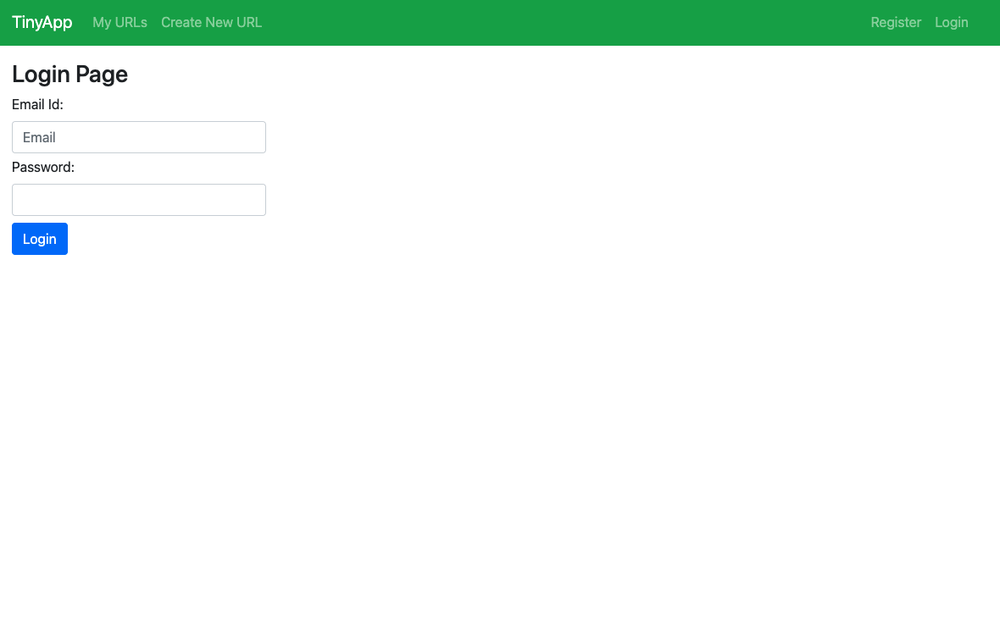

# TinyApp Project - Version 1.0

TinyApp is a full stack web application built with Node and Express that allows users to:


- Register and Login using email id 
- Enter a URL and display short URLs for each URLs
- Edit and/or delete a url from their database
- Allow and redirect to the URL using its shortened version 

*Logged in users only have the access to the URLs they added. They cannot see/edit/delete the URLs of other users*

## Final Product




## Dependencies

- Node.js
- Express
- EJS
- method-override
- bcrypt
- body-parser
- cookie-session

## Getting Started

- Install all dependencies:
```npm install <package> --save```

- Run the development web server:
`npm start`

- For testing:
`npm test`

- Run the app on browser:
`http://localhost:8080`
